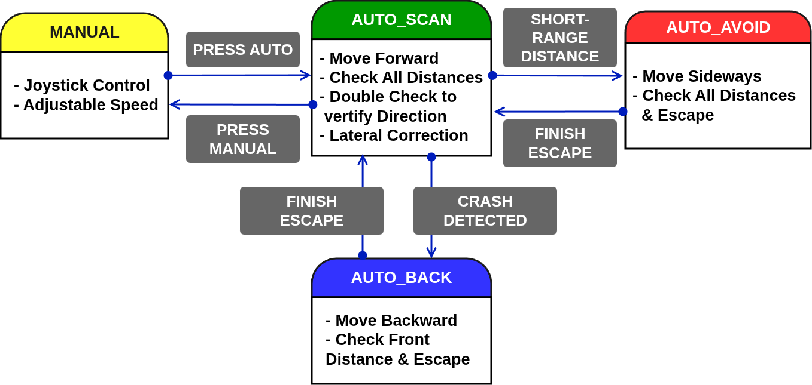

# :car:  Project 3  AutoMobility 

## **1. Project Summary (프로젝트 요약)**
STM32(MCU)를 활용하여 블루투스를 통한 수동조종(Manual) 및 자율주행(Auto) 시스템 제작

## 2. Key Features (주요 기능)

### 🕹️ Manual Mode (수동 제어)

- 조이스틱(Joystick)을 통해 차체를 조종가능
- PWM 신호를 통해 자동차의 속도를 변경 가능하고 이를 조이스틱 감도로 제어가능

### 🤖 Auto Mode (자율주행)

- 센서(Ultrasonic) 데이터를 기반으로 장애물 회피
- 데이터를 이중으로 비교하여 회전 중에도 재판단
- 코너에 진입했는데 전면과의 거리가 너무 가까우면 넓은 방향으로 후진

## 3. 🛠 Tech Stack (기술 스택)

### 3.1 Language (사용언어)

### 3.2 Development Environment (개발 환경)
| IDE | Configuration |
| :---: | :---: |
|  |  |
| **STM32CubeIDE** | **STM32CubeMX** |

### 3.3 Collaboration Tools (협업 도구)

## 4. 📂 프로젝트 구조 (Project Structure)

### 4.1 Hardware BlockDiagram (하드웨어 블록다이어그램)

### 4.2 State Machine (상태)

